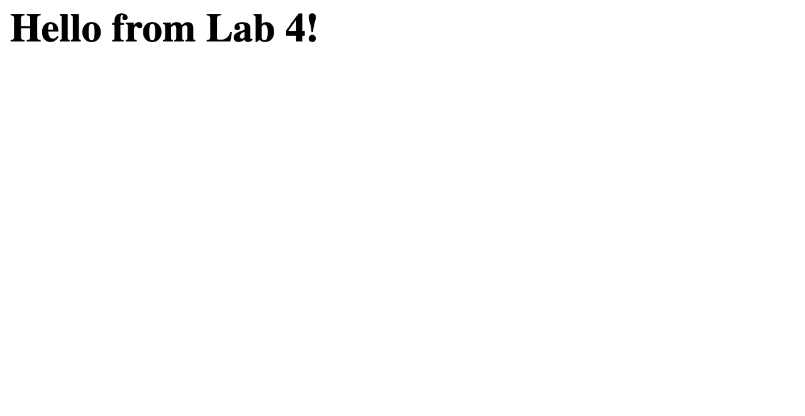

# cit281-lab-4
lab4 
This lab is about creating initial Fastify Node.js web server and initialize as a Node.js project folder using Node Package Manager.

This lab also include our previous object, such as add git repo, exclude node_modules folder from git, and make commits. 

This lab also requred us to import and export module, and sets a connerstone for the project.

